## Flowchart

[Documentation](https://mermaid.js.org/syntax/flowchart.html)

```md
flowchart LR

A[Hard] -->|Text| B(Round)
B --> C{Decision}
C -->|One| D[Result 1]
C -->|Two| E[Result 2]
```

<figure class="example"><div>

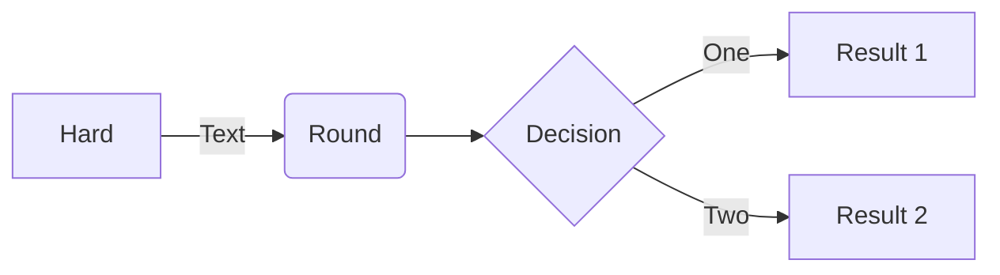
</div></figure>

## Sequence Diagram

[Documentation](https://mermaid.js.org/syntax/sequenceDiagram.html)


```md
sequenceDiagram
Alice->>John: Hello John, how are you?
loop HealthCheck
    John->>John: Fight against hypochondria
end
Note right of John: Rational thoughts!
John-->>Alice: Great!
John->>Bob: How about you?
Bob-->>John: Jolly good!
```

<figure class="example"><div>

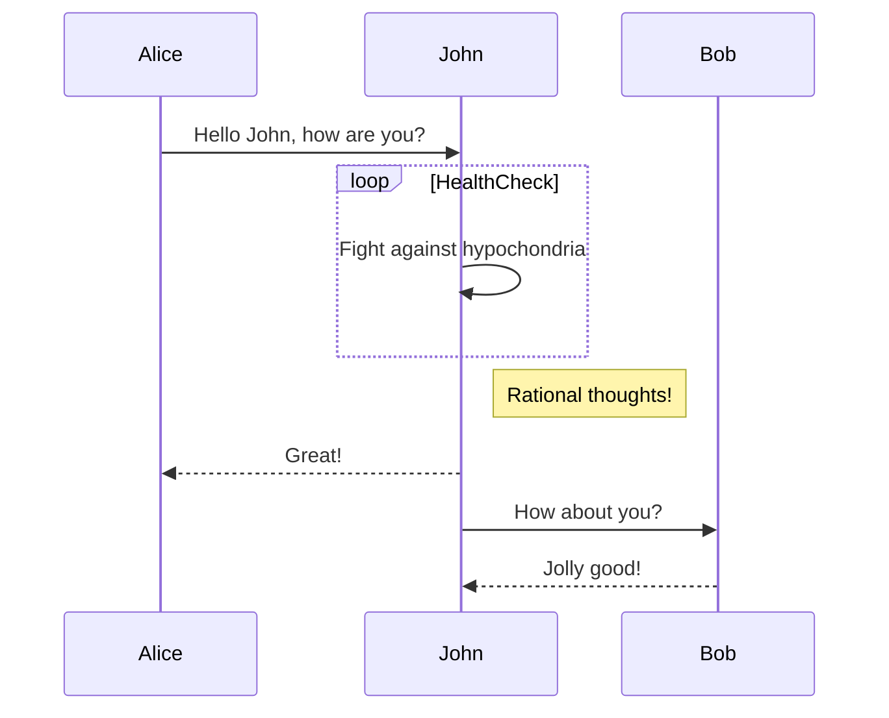
</div></figure>

## Class Diagram

[Documentation](https://mermaid.js.org/syntax/classDiagram.html)

```md
---
title: Animal example
---
classDiagram
    note "From Duck till Zebra"
    Animal <|-- Duck
    note for Duck "can fly\ncan swim\ncan dive\ncan help in debugging"
    Animal <|-- Fish
    Animal <|-- Zebra
    Animal : +int age
    Animal : +String gender
    Animal: +isMammal()
    Animal: +mate()
    class Duck{
        +String beakColor
        +swim()
        +quack()
    }
    class Fish{
        -int sizeInFeet
        -canEat()
    }
    class Zebra{
        +bool is_wild
        +run()
    }
```

<figure class="example"><div>

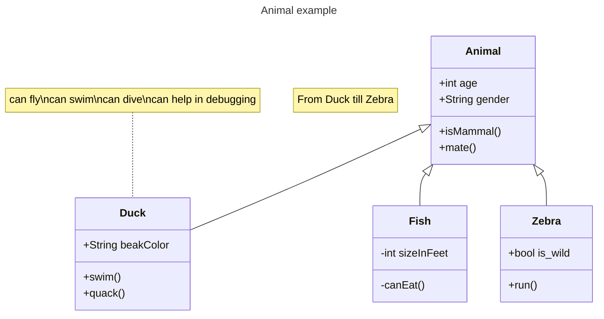
</div></figure>

## State Diagram

[Documentation](https://mermaid.js.org/syntax/stateDiagram.html)


```md
stateDiagram-v2
[*] --> Still
Still --> [*]
Still --> Moving
Moving --> Still
Moving --> Crash
Crash --> [*]
```

<figure class="example"><div>

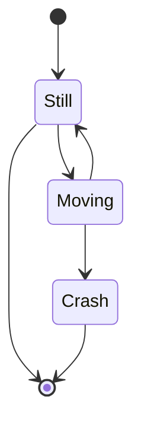
</div></figure>

## Entity Relationship Diagram

[Documentation](https://mermaid.js.org/syntax/entityRelationshipDiagram.html)

## User Journey

[Documentation](https://mermaid.js.org/syntax/userJourney.html)


```
  journey
    title My working day
    section Go to work
      Make tea: 5: Me
      Go upstairs: 3: Me
      Do work: 1: Me, Cat
    section Go home
      Go downstairs: 5: Me
      Sit down: 3: Me
```

<figure class="example"><div>

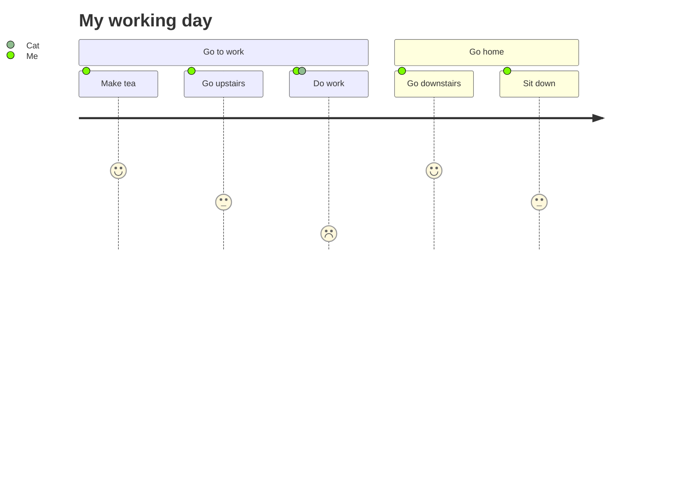
</div></figure>

## Gantt

[Documentation](https://mermaid.js.org/syntax/gantt.html)

```md
gantt
    section Section
    Completed :done,    des1, 2014-01-06,2014-01-08
    Active        :active,  des2, 2014-01-07, 3d
    Parallel 1   :         des3, after des1, 1d
    Parallel 2   :         des4, after des1, 1d
    Parallel 3   :         des5, after des3, 1d
    Parallel 4   :         des6, after des4, 1d
```

<figure class="example"><div>

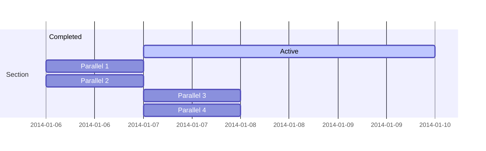
</div></figure>

### Bar chart (using gantt chart)

```md
gantt
    title Git Issues - days since last update
    dateFormat  X
    axisFormat %s

    section Issue19062
    71   : 0, 71
    section Issue19401
    36   : 0, 36
    section Issue193
    34   : 0, 34
    section Issue7441
    9    : 0, 9
    section Issue1300
    5    : 0, 5
```

<figure class="example"><div>

```mermaid
gantt
    title Git Issues - days since last update
    dateFormat  X
    axisFormat %s

    section Issue19062
    71   : 0, 71
    section Issue19401
    36   : 0, 36
    section Issue193
    34   : 0, 34
    section Issue7441
    9    : 0, 9
    section Issue1300
    5    : 0, 5
```
</div></figure>

## Pie Chart

[Documentation](https://mermaid.js.org/syntax/pie.html)


```md
pie
"Dogs" : 386
"Cats" : 85.9
"Rats" : 15
```

<figure class="example"><div>

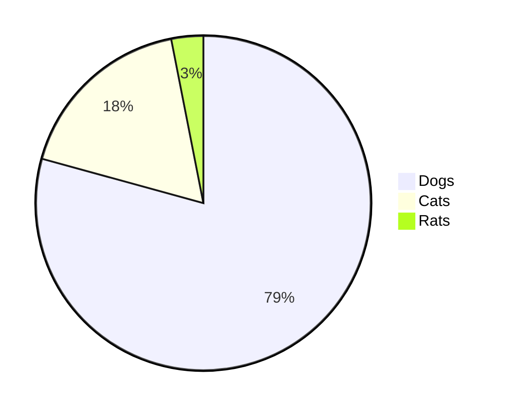
</div></figure>

## Quadrant Chart

[Documentation](https://mermaid.js.org/syntax/quadrantChart.html)


```
quadrantChart
    title Reach and engagement of campaigns
    x-axis Low Reach --> High Reach
    y-axis Low Engagement --> High Engagement
    quadrant-1 We should expand
    quadrant-2 Need to promote
    quadrant-3 Re-evaluate
    quadrant-4 May be improved
    Campaign A: [0.3, 0.6]
    Campaign B: [0.45, 0.23]
    Campaign C: [0.57, 0.69]
    Campaign D: [0.78, 0.34]
    Campaign E: [0.40, 0.34]
    Campaign F: [0.35, 0.78]
```

<figure class="example"><div>

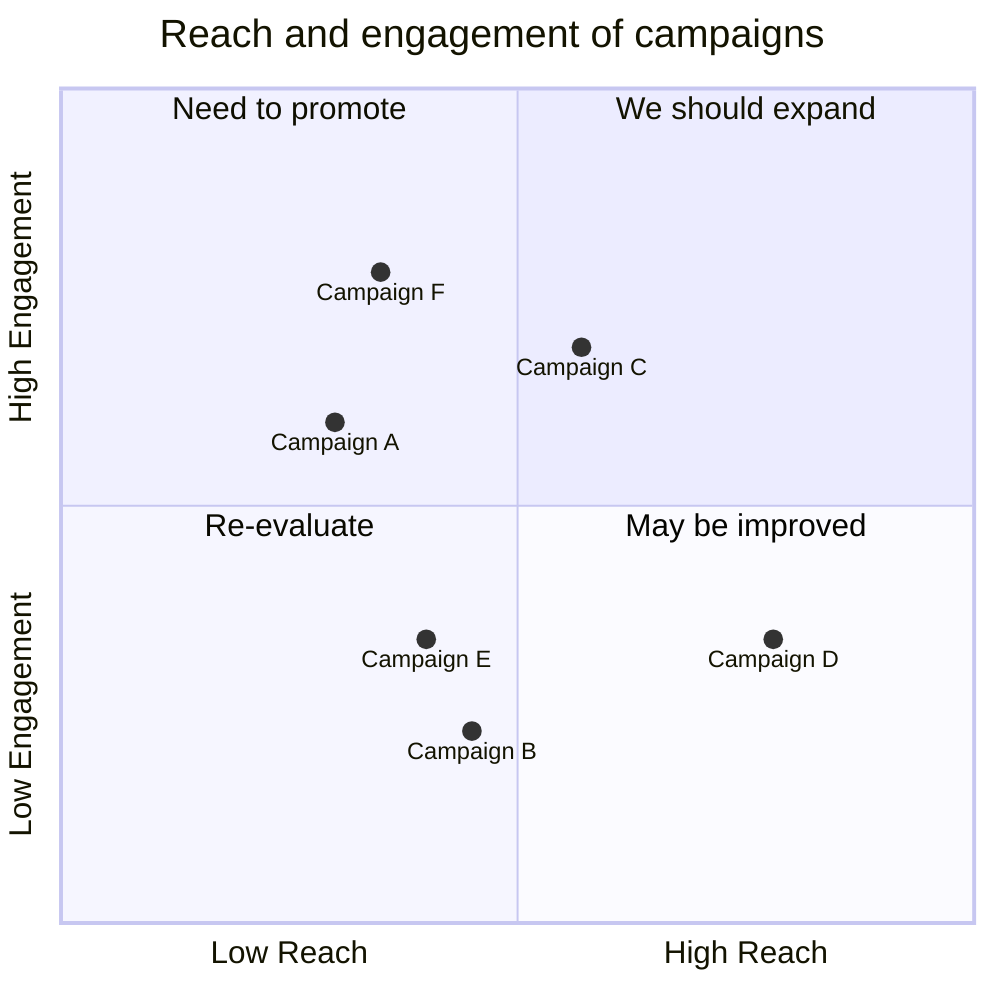
</div></figure>

## Requirement Diagram

[Documentation](https://mermaid.js.org/syntax/requirementDiagram.html)

## Gitgraph (Git) Diagram

[Documentation](https://mermaid.js.org/syntax/gitgraph.html)


```md
---
title: Example Git diagram
---
gitGraph
    commit id: "1"
    commit id: "2"
    branch nice_feature
    checkout nice_feature
    commit id: "3"
    checkout main
    commit id: "4"
    checkout nice_feature
    branch very_nice_feature
    checkout very_nice_feature
    commit id: "5"
    checkout main
    commit id: "6"
    checkout nice_feature
    commit id: "7"
    checkout main
    merge nice_feature id: "customID" tag: "customTag" type: REVERSE
    checkout very_nice_feature
    commit id: "8"
    checkout main
    commit id: "9"
```

<figure class="example"><div>

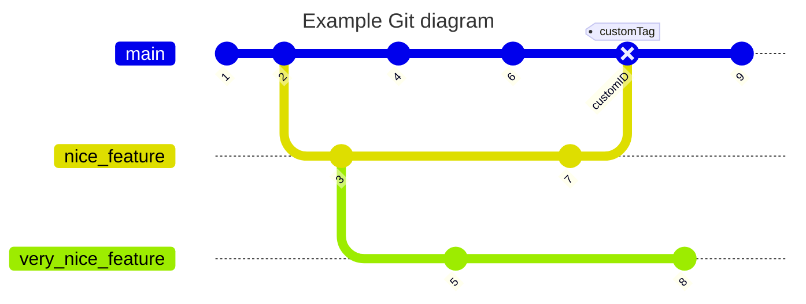
</div></figure>

## C4 Diagram ⚠️

[Documentation](https://mermaid.js.org/syntax/c4.html)


```
C4Context
title System Context diagram for Internet Banking System

Person(customerA, "Banking Customer A", "A customer of the bank, with personal bank accounts.")
Person(customerB, "Banking Customer B")
Person_Ext(customerC, "Banking Customer C")
System(SystemAA, "Internet Banking System", "Allows customers to view information about their bank accounts, and make payments.")

Person(customerD, "Banking Customer D", "A customer of the bank, <br/> with personal bank accounts.")

Enterprise_Boundary(b1, "BankBoundary") {

  SystemDb_Ext(SystemE, "Mainframe Banking System", "Stores all of the core banking information about customers, accounts, transactions, etc.")

  System_Boundary(b2, "BankBoundary2") {
    System(SystemA, "Banking System A")
    System(SystemB, "Banking System B", "A system of the bank, with personal bank accounts.")
  }

  System_Ext(SystemC, "E-mail system", "The internal Microsoft Exchange e-mail system.")
  SystemDb(SystemD, "Banking System D Database", "A system of the bank, with personal bank accounts.")

  Boundary(b3, "BankBoundary3", "boundary") {
    SystemQueue(SystemF, "Banking System F Queue", "A system of the bank, with personal bank accounts.")
    SystemQueue_Ext(SystemG, "Banking System G Queue", "A system of the bank, with personal bank accounts.")
  }
}

BiRel(customerA, SystemAA, "Uses")
BiRel(SystemAA, SystemE, "Uses")
Rel(SystemAA, SystemC, "Sends e-mails", "SMTP")
Rel(SystemC, customerA, "Sends e-mails to")
```

<figure class="example"><div>

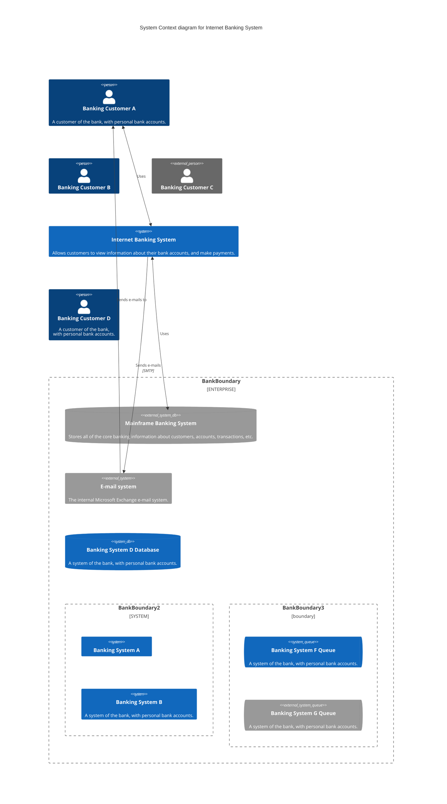
</div></figure>

## Mindmaps

[Documentation](https://mermaid.js.org/syntax/mindmap.html)


```md
mindmap
  root((mindmap))
    Origins
      Long history
      ::icon(fa fa-book)
      Popularisation
        British popular psychology author Tony Buzan
    Research
      On effectiveness<br/>and features
      On Automatic creation
        Uses
            Creative techniques
            Strategic planning
            Argument mapping
    Tools
      Pen and paper
      Mermaid
```

<figure class="example"><div>

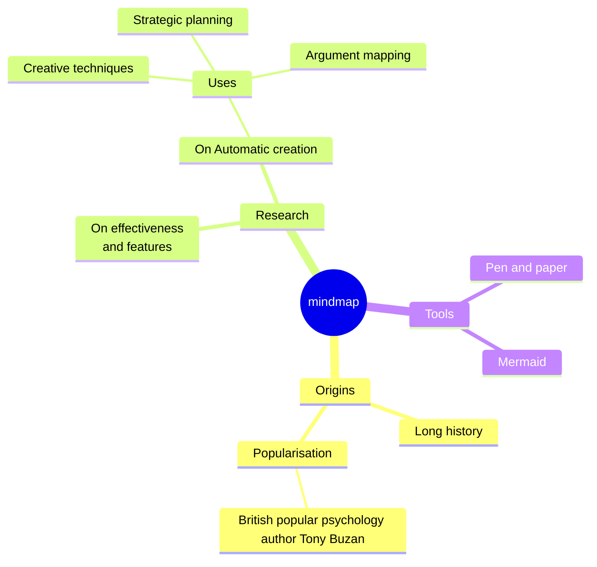
</div></figure>

## Timeline

[Documentation](https://mermaid.js.org/syntax/timeline.html)


```md
timeline
    title Timeline of Industrial Revolution
    section 17th-20th century
        Industry 1.0 : Machinery, Water power, Steam <br>power
        Industry 2.0 : Electricity, Internal combustion engine, Mass production
        Industry 3.0 : Electronics, Computers, Automation
    section 21st century
        Industry 4.0 : Internet, Robotics, Internet of Things
        Industry 5.0 : Artificial intelligence, Big data, 3D printing
```
<figure class="example"><div>

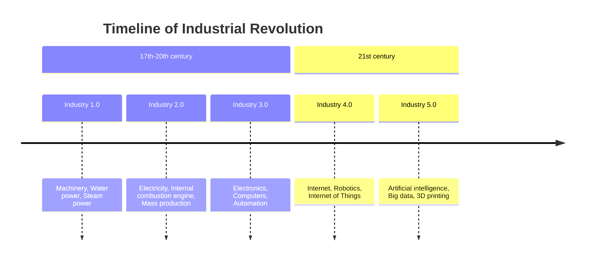
</div></figure>

## Zenuml

[Documentation](https://mermaid.js.org/syntax/zenuml.html)

## Sankey

[Documentation](https://mermaid.js.org/syntax/sankey.html)

## XYChart 🔥

[Documentation](https://mermaid.js.org/syntax/xyChart.html)


```md
---
config:
    xyChart:
        width: 900
        height: 600
    themeVariables:
        xyChart:
            titleColor: "#ff0000"
---
xychart-beta
    title "Sales Revenue"
    x-axis [jan, feb, mar, apr, may, jun, jul, aug, sep, oct, nov, dec]
    y-axis "Revenue (in $)" 4000 --> 11000
    bar [5000, 6000, 7500, 8200, 9500, 10500, 11000, 10200, 9200, 8500, 7000, 6000]
    line [5000, 6000, 7500, 8200, 9500, 10500, 11000, 10200, 9200, 8500, 7000, 6000]
```

<figure class="example"><div>

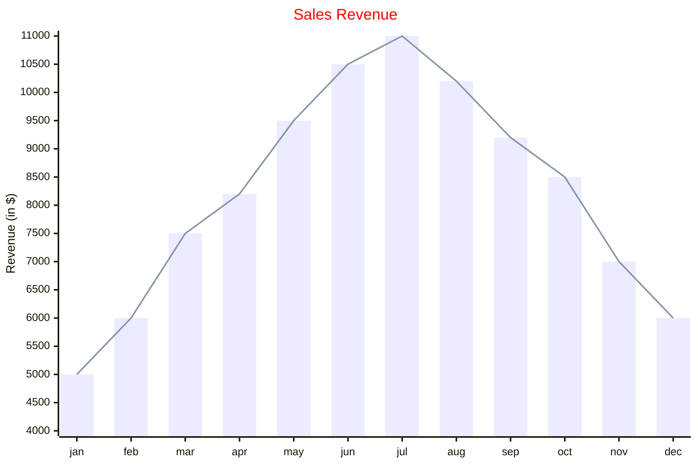
</div></figure>

## Block Diagram 🔥

[Documentation](https://mermaid.js.org/syntax/block.html)


```md
block-beta
columns 1
  db(("DB"))
  blockArrowId6<["&nbsp;&nbsp;&nbsp;"]>(down)
  block:ID
    A
    B["A wide one in the middle"]
    C
  end
  space
  D
  ID --> D
  C --> D
  style B fill:#969,stroke:#333,stroke-width:4px
```

<figure class="example"><div>

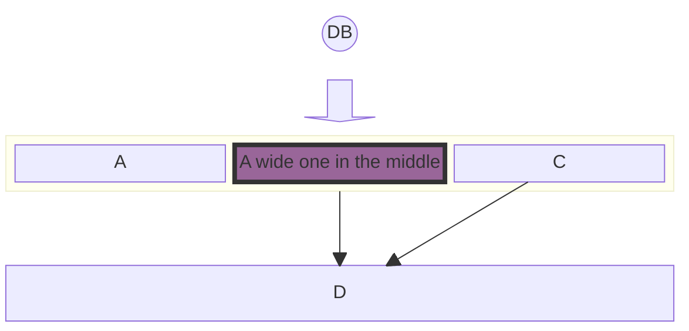
</div></figure>

## Other Examples</p>

[Documentation](https://mermaid.js.org/syntax/examples.html)

## TODO

- study `npm i mermaid-isomorphic`
- study https://perryvw.github.io/mermaid-markdown-docs/#/
- https://habr.com/ru/companies/X5Tech/articles/821687/
