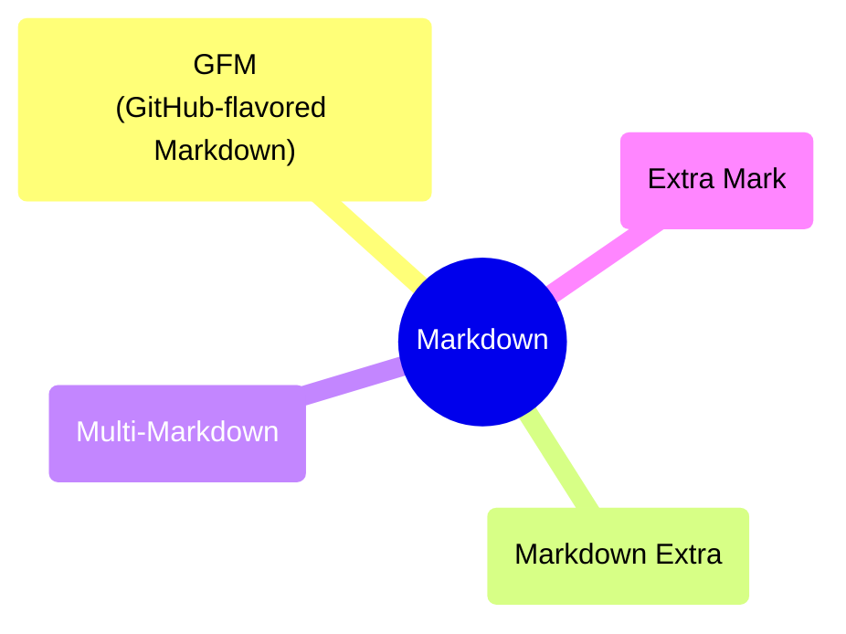

**Markdown** --- удобочитаемый язык разметки, который прозрачно конвертируется в HTML. Его можно открывать и изменять в любом редакторе текста. Широко используется для написания документаций и README-файлов.

!!!note ПРИМЕЧАНИЕ
    _Язык разметки_ --- это язык, который использует теги или символы для применения стилизации к содержимому. Самыми популярными языками разметки в мире являются HTML, XML и Markdown.


Вы можете встретить **Markdown** в `.md` или `.markdown` файлах:

```md

```

Файл _Markdown_ или _MD_ состоит из простого текста, прост для понимания и не содержит всей этой разметки HTML, загрязняющей содержимое и затрудняющей восприятие.

!!!note ПРИМЕЧАНИЕ
    MD --- это сокращение от Markdown.

С помощью Markdown вы можете добавить к документу форматирование с помощью разметки символов. Вот как будет выглядеть пример выше после преобразования:


<figure class="example"><iframe title="Пример" src="/examples/example/" width="100%" width="auto" height="600"></iframe></figure>

Важно отметить, что формат Markdown отличается от формата, используемого некоторыми редакторами **WYSIWYG** .

!!!note ПРИМЕЧАНИЕ
    WYSIWYG --- это сокращение от What You See Is What You Get . В основном форматирование контента происходит в реальном времени, то есть видно сразу. Чтобы узнать больше, вы можете обратиться к этой [статье Википедии](https://en.wikipedia.org/wiki/WYSIWYG).
    
    Например, в Microsoft Word, который является редактором WYSIWYG, форматирование текста происходит при выборе определенного содержимого и нажатии определенной кнопки, комбинации клавиш или некоторого пункта меню.

В Markdown форматирование применяется с использованием таких символов, как знак решетка `#`, звездочка `*` и подчеркивание `_` и другие.

Эти символы используются процессором Markdown, чтобы узнать, какие слова / фразы следует форматировать при преобразовании файла в HTML.

Например, `**Я хочу, чтобы этот текст был полужирным**` и `_этот текст курсивом_`.

Слишком запутались? Немного упростим.

Когда вы окружаете контент двумя звездочками `**`, вы выделяете его жирным шрифтом, во втором примере мы используем подчеркивание `_`, чтобы применить курсив.


## Как редактировать файл Markdown

Файл _Markdown_ - это не что иное, как текст, поэтому для этой задачи достаточно любого простого текстового редактора.

Установите Visual Studio Code и расширение HTML Preview, сохраните новый файл с любым именем и расширением md, а потом нажмите ctrl+k v. После этого можете играть с маркдауном и сразу смотреть, что получается. Все примеры из статьи как раз сделаны там.


Ну или используйте любой онлайн-редактор, например, [Dillinger](https://dillinger.io/) или [Stackedit](https://stackedit.io/app).

## Варианты синтаксиса Markdown

Представьте себе все разные диалекты, существующие в одном языке, сленг, произношения, акценты. Даже носителям языка иногда бывает сложно понять некоторые вещи.



Что ж, как и в случае с языками, реализации Markdown в разных программах также могут отличаться, даже если разница незначительна, она все равно может вызвать путаницу.

Варианты Markdown называются Flavors, например, GitHub использует немного более надежную версию Markdown, называемую [GitHub-flavored Markdown или GFM](https://github.github.com/gfm/).

Некоторые приложения используют только базовый синтаксис, другие используют комбинацию базового синтаксиса и расширенного синтаксиса, и, наконец, есть приложения, которые время от времени реализуют элементы обоих.

Что делать?

Лучший способ понять приложение - обратиться к его документации. Вы также можете использовать старую добрую тактику проб и ошибок. В разделе [Элементы](/md/elements) перечислены элементы Markdown, которые можно использовать в документации в рамках данной системы.

Некоторые примеры "ароматов" Markdown:
- [GFM (GitHub-flavored Markdown)](https://github.github.com/gfm/)
- [MultiMarkdown](https://fletcherpenney.net/multimarkdown/)
- [Markdown Extra](https://michelf.ca/projects/php-markdown/extra/)
- [Kramdown](https://kramdown.gettalong.org/)

## Вывод

В этой статье вы узнали об основных аспектах Markdown, о том, что вы можете с ним делать, и о различных его реализациях.

Следующим шагом является [изучение основного синтаксиса языка](/md/basics/) или, если вы уже уверены, обратитесь к разделу [Элементы](/md/elements), чтобы начать использовать Markdown.


## Ссылки

[Полное руководство Markdown для начинающих](https://ru.markdown.net.br/)
[4 стихии программной документации: The Grand Unified Theory of Documentation](https://habr.com/ru/companies/bercut/articles/806805/)
